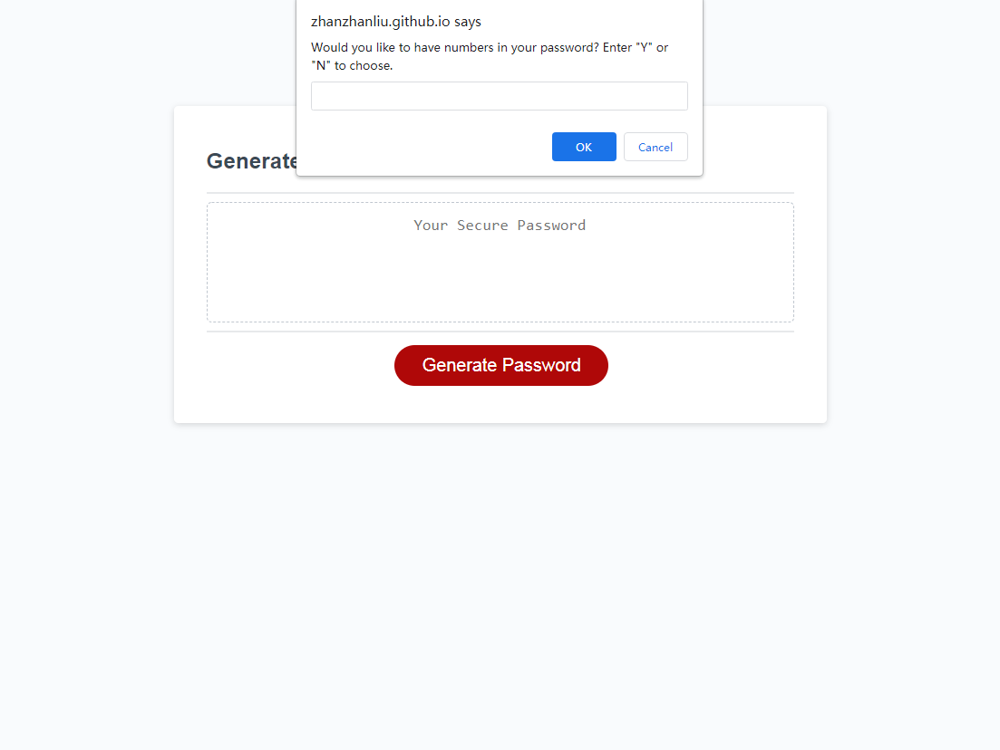

# JavaScript Challenge: Password Generator - by Zhanzhan Liu

## Purpose
Access to sesitive data is an essential part during work, so a random password generator is needed so that the user can create a strong password which provides greater security according to the criterias. This chanllenge is helping practicing building functions through javascripts which can achieve an webpage buildin application for multiple uses.

## Build with
* HTML
* CSS
* JavaScript

## Website
https://zhanzhanliu.github.io/password-generator/

## Respository Link
https://github.com/zhanzhanLiu/password-generator

## What to expect
* After clicking generate password, a prompt will pop up asking the length of the password. The length should be between 8 to 128 characters.

* After entering the proper length, it will ask you to choose if you would like to include lowercase letters, uppercase letters, numbers, or special characters for the password. The anwer should be "Y" or "N" and at least one type should have the asnwer "Y". If not, it will start asking from the lowercase letters until the user selected one.

* If everything is entered correctly, a password will show up in the box under Generate a Password.

* Click generate password button again, it will ask for length and types of characters again.

## Screenshots 

